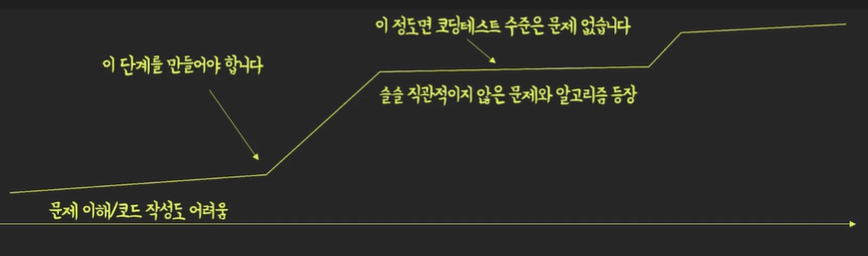

# 코딩테스트 대비하기
## 알고리즘 공부가 어려운 이유- 1
### - 정답을 계산하는 주체가 다르다
  
바로 내가 생각한 자유분방한 풀이 방법과 동일한 과정을 프로그램이 수행할 수 있도록 프로그래밍적으로 구현해야 하는 것입니다.

프로그램이 사람과 같은 수준의 사고를 할 수는 없으므로, 우리가 관점을 바꾸어 프로그램의 레벨에서 생각을 해야합니다.

그렇기에 우리는 조금 더 구체적이고, 절차적이고,

단순한 과정들로 문제의 풀이 방법을 설계 해야만 합니다. 한마디로 정답을 설계하는 방식에 큰 제약이 걸리게 된다는 점이죠.
### - 입력과 출력이 가변적이고 예측 할 수 없다
프로그램을 채점할 때에 어떤 숫자가 입력으로 주어질 지 모릅니다. 그렇기에 우리는 프로그램이 어떤 값을 출력해야 할 지도 입력을 받기 전 까 지는 알 수 없습니다. 

결과적으로 입력 제한 내에서 주어질 수 있는 모든 N에 대해서 항상 올바른 정답을 잘 계산할 수 있는 프로그램을 작성해야 합니다. 우리가 작성한 프로그램이 어떤 입력이 주어져도 정답을 잘 구할 수 있을지 검증하고 또 우리가 설계한 알고리즘에 반례가 존재하는 지 점검하는 것들도 우리의 몫입니다.

## 알고리즘 문제 해결의 과정
### 1. 문제의 추상화
일상적인 표현으로 작성된 문제의 지문을 읽고 요구사항을 파악하는 과정
### 2. 알고리즘 설계
주어진 입력을 받아서 요구한 출력을 하기까지의 과정을 컴퓨터가 실행 가능한 형태로 구체적으로 설계

문제에서 주어진 여러가지 제약사항(시간, 공간, 정확도 등)을 만족하는 효율적인 알고리즘을 설계
### 3. 알고리즘 구현
논리적으로 완벽한 알고리즘일지라도 프로그래밍 언어로 구현할 수 없다면 문제를 해결 할 수 없다 

프로그래밍 경험과 사용하는 언어에 대한 이해가 필요
### 4. 검증과 트러블 슈팅
내가 설계한 알고리즘과 구현한 소스코드가 문제의 요구사항을 정확히 만족하는지 검증 

설계와 구현 전후로 자신의 방법론을 검증하고, 문제가 되는 부분을 찾아 빠르게 해결하는 능력이 필요

## 알고리즘 공부가 어려운 이유 - 2
### 꾸준한 공부가 필요한 이유
프로그래밍 조차 서툰 우리에겐 모든 단계 단계가 느리고 지난합니다. 

반복된 훈련은 아래의 두 단계를 빠르게 만들어 줍니다.

- `1.문제의 추상화`
- `3.알고리즘 구현`

문제를 읽고 무엇을 해야할지 이해하는 것, 

내가 설계한 알고리즘을 코드로 옮기는것 

이 두가지는 훈련으로 거의 시간소요를 하지 않게 줄일 필요가 있습니다

-> 다작이 필요합니다

### 공부의 속도가 붙는 시기
문제를 이해하고, 코드를 작성하기, 틀린 코드를 디버깅하는 것이 편해진다면 오직 아래의 단계만 공부하는 것으로 풀 수 있는 문제량이 폭중합니다

- `2.알고리즘 설계`
  
주어진 입력을 받아서 요구한 출력을 하기까지의 과정을 컴퓨터가 실행 가능한 형태로 구체적으로 설계 

문제에서 주어진 여러가지 제약사항(시간, 공간, 정확도 등)을 만족하는 효율적인 알고리즘을 설계

## 코드에 발목잡히지 않는 구현 훈련하기

### 문제 읽기/구현 능력 훈련은··· 엉덩이 싸움
최대한 다양한 플랫폼/형식/지문스타일 등을 편식없이 많이 만나보세요

쉬운 문제들 위주로 다양한 형태의 경험을 해보세요

코딩테스트가 처음이라면 약 100~200문제 정도 푸는걸 목표로!
### 백준 solved.ac 클리어하기
Solved.ac 서비스의 Class를 1~2, 3레벨까지 쭉 풀어보시길 권장합니다

 푸는 사람이 많아 웹에서 다양한 풀이를 찾기도 용이합니다
### 프로그래머스 기초문제 클리어하기
가장 많이 사용되는 코딩테스트 플랫폼에 익숙해지기

다양한 한국어 문제 유형 제공
### Leet Code- Easy 문제 클리어하기
대표적인 알고리즘 코딩테스트 및 코딩인터뷰 문제 스타일 플랫폼
Well-Known 알고리즘 및 표준 스타일 문제들을 접할 수 있다

## 알고리즘 늘려가기 페이즈 
### 문제 결정하기
일상적인 표현으로 작성된 문제의 지문을 읽고 요구사항을 파악하는 과정
### 1시간 타이머로 초집중하기
실제 코딩테스트 처럼 1시간동안 집중하여 문제를 시도해봅니다.

그냥 시간을 채우는 것이 아닌, 내가 아는 모든 방법과 경험을 동원'해보는데에 초점을 맞춰야 합니다
### 해설 기반으로 학습하기
문제의 '풀이'를 이해해서 본인 코드로 옮길 수 있게 연습하세요

'코드'를 따라 타이핑하는게 아니라 해설'을 코드로 옮기는게 목표입니다.

그래야 3. 알고리즘 구현 능력을 기를 수 있습니다

## 합격 목표치
### 코딩테스트 합격을 위한 목표치 설정하기
다음 정도 난이도의 문제를 랜덤으로 선택한 후,

1시간내에 도전해서 해결하는 비중이 50%를 넘긴다면 대부분의 코딩테스트 걱정은 덜어도 충분합니다

- 백준(solved) - 골드 3~5
- 프로그래머스 - 레벨 3
- Leetcode - Medium 난이도

### 기출문제 꼭 풀어보기
문제를 자체제작하는 기업의 공개된 기출문제는 꼭 풀어보시길 권장합니다 

만점이 목표가 아닌, 시간내에 합격선을 넘기는게 목표라는 것을 잊지마세요 

#### 예: 프로그래머스- 카카오 채용 코딩테스트 기출 
#### 예 : 백준 - 삼성 코딩테스트 기출 문제집 
#### 예 : 삼성 소프트웨어아카데미