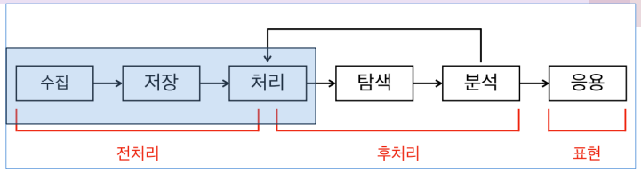
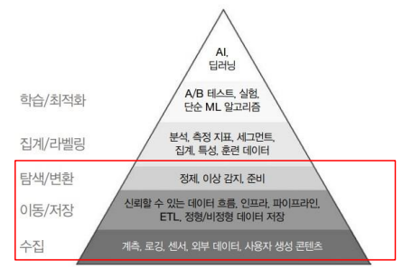

# Data Engineering(데이터 엔지니어링)

데이터 엔제니어링이란, 실제 운영 환경에서 데이터 과학 및 분석에 필요한 기반을 구축하는 일련의 작업
- 수집 (내/외부 데이터 연동 및 통합)
- 저장 (대용량/ 실시간 데이터 분산 저장)
- 처리 (데이터 선택, 변환, 통합, 축소)

## 무슨 일을 할까?
- 데이터를 가져와 저장하고, 데이터 사이언스나 분석가 등이 사용할 수 있도록 준비하는 과정
- 데이터 엔지니어
    - 원천 시스템에서 데이터를 가져오는 것부터 시작해, 분석 또는 머신러닝과 같은 사용 사례에 데이터를 제공하는 것으로 끝나는 데이터 엔지니어링 수명 주기를 관리하는 업무를 다룸

## Web Scraping vs Web Crawling
### 웹 스크래핑(Web Scraping)이란?
- 웹 스크래핑은 **`특정 웹 사이트나 페이지에서`** 필요한 데이터를 자동으로 추출해 내는 것을
의미
### 웹 크롤링(Web Crawling)이란?
- 웹 크롤링이란 `웹상의 정보들을` 탐색하고 수집하는 작업을 의미
- 인터넷에 존재하는 방대한 양의 정보를 사람이 일일히 파악하는 것이 불가능하여 규칙에 따라 자동으로 웹 문서를 탐색하는 컴퓨터 프로그램, 웹 크롤러(Crawler)가 등장
- 단, 지금은 용어의 구분 없이 보통 웹 크롤링 이라고 지칭하는 경우가 많다

## Linux 기본 명령어
1. user
- su [사용자명] : 해당 사용자로 변경
- sudo [명령] : 관리자 권한으로 실행( sudoers 등록 필요)
- id [사용자명] : 사용자 정보 확인
- passwd [사용자명] : 사용자 비밀번호 설정
2. file
- cp file1 file2 : file 복사
- mv file1 file2 : file 이동(변경)
- rm file1 : file 삭제
- mkdir dir1 : directory 생성
- cp -r dir1 dir2 : directory 복사
- mv dir1 dir2 : directory 이동(변경)
- rm -r dir1 : directory 삭제

### 파일권한
r : read  :  4

w : write  :  2

x : execute  :  1

\- : 권한이 없음
