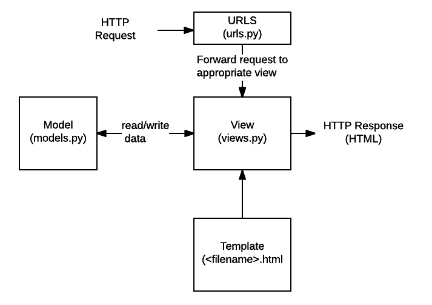

# Django 란?

Django는 파이썬 웹 프레임워크이다.
앞서 배운 Flask에 비해 많은 기능들을 기본적으로 제공한다.
웹을 개발하기 위한 대부분의 기능들을 제공하기 때문에, Django만으로도 규모가 있는 웹 서비스를 개발할 수 있다.
Flask에 비해서 커뮤니티가 크고, 잘 활성화 되어있기 때문에 정보교류가 활발한 편이다.


## Django 설치


> $ pip install django

장고를 사용하기 위해서는 장고 프로젝트를 시작해야 한다.

대부분의 경우 하나의 웹 서비스는 하나의 장고 프로젝트로 이루어져 있고,
그 내부에 여러개의 기능(App)으로 구성되어 있다.

## 장고 프로젝트 생성
프로젝트를 하나 만들기

> $ django-admin startproject `[프로젝트명]`

## 프로젝트 진입

> $ cd `[프로젝트명]`

프로젝트 폴더 내부로 들어왔으면 Django가 사용할 데이터 베이스를 생성한다.


## 장고 프로젝트 실행하기

이제 데이터 베이스도 만들었으니 프로젝트를 실행해서 서버를 한번 켜보자.

> $ python manage.py runserver 


## 페이지 만들기
프로젝트를 만들었지만 페이지를 추가하려면 앱(App)을 생성해야함.
장고의 모든 프로젝트는 여러개의 HTML과 .py파일로 이루어진 앱들이 여러개 모여서 만들어진다.

## 앱 생성하기

> $ python manage.py startapp `[앱이름]`

## 사전 등록하기

앱을 만들었으면 프로젝트에서 사용할 수 있도록 등록을 해야한다.
`[프로젝트명]`/settings.py의 약 40번째 줄인 INSTALLED_APPS에 아래와 같이 추가해준다.
```python
INSTALLED_APPS = [
    'django.contrib.admin',
    'django.contrib.auth',
    'django.contrib.contenttypes',
    'django.contrib.sessions',
    'django.contrib.messages',
    'django.contrib.staticfiles',
    '앱이름',
]
```
## model 설정
app의 models.py에 들어가서 모델링을 해준다

model이란?
- class를 만들어서 데이터를 관리한다
- class가 테이블을 생성한다

```python
from django.db import models

# Create your models here.
# 다른 모델을 상속받아서 사용하고 있다
class student(models.Model):
    name = models.CharField(max_length=10)
    address = models.TextField()
    major = models.CharField(max_length=100)
    age = models.IntegerField()
    cgpa = models.FloatField()

```
## Django 내부 코드와 연동
데이터 베이스와 연동을 하기위에 아래와 같은 코드를 사용해야 한다

ORM: django에서 DB를 사용할 수 있는 이유는 `ORM`이 있기 때문이다
(python에서 sql로 이어주는 번역기 역할)
- Object
- Relational
- Mapping


```python
# DB로 전송 직전까지 코드로 변환
$ python manage.py makemigrations <app name>
# DB로 전송
$ python manage.py migrate <app name>
```
## HTML파일 생성
이제 [프로젝트명]/[앱이름]/templates/[앱이름]폴더를 하나 만들어,
그 안에 index.html파일을 만들기
```python
<!DOCTYPE html>
<html lang="en">
<head>
    <meta charset="UTF-8">
    <title>Title</title>
</head>
<body>
    장고 페이지
</body>
</html>
```
## HTML파일 인코딩
html 파일을 인코딩해서 웹에 띄우는 작업을 해야한다.
main/views.py파일을 열어 다음 코드를 추가해준다.
```
from django.shortcuts import render

# Create your views here.
def index(request):
    return render(request,'main/index.html')
```
## view와 url을 연결
[앱이름]/urls.py파일을 하나 새로 만들어 아래의 코드를 추가해준다.
```
from django.urls import path

from . import views


urlpatterns = [
    path('', views.index, name='index'),
]
```
### 앱의 url과 프로젝트의 url을 연결 
[프로젝트명]/urls.py에 들어가서 아래와 같이 바꾸기
```
from django.contrib import admin
from django.urls import path, include

urlpatterns = [
    path('admin/', admin.site.urls),
    path('', include('[앱이름].urls')),
]
```
터미널에 아까전에 서버를 호스팅하는데 사용했던
명령어를 입력해 우리가 만든 페이지 호스팅

> $ python manage.py runserver

