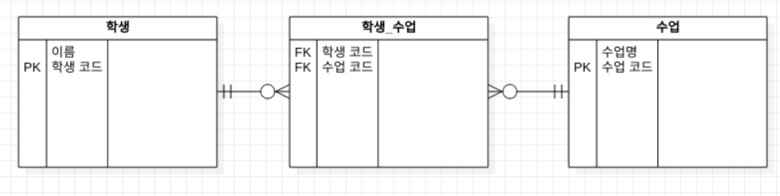

# N:M 관계(다대다 관계)
N:M 관계는 관계를 가진 양쪽 엔티티 모두에서 1:N 관계를 가지는 것을 말한다.

즉, 서로가 서로를 1:N 관계로 보고 있는 것이다.

N:M 관계는 서로가 서로를 1:N 관계, 1:M 관계로 갖고 있기 때문에, 서로의 PK를 자신의 외래키 컬럼으로 갖고 있으면 된다.

일반적으로 N:M 관계는 두 테이블의 대표키를 컬럼으로 갖는 또 다른 테이블을 생성해서 관리한다.

- 예시
  -  쇼핑몰에서 회원과 상품이 관계를 맺을 수 있습니다.한 회원은 쇼핑몰의 여러 상품들을 가질 수 있습니다.청바지, 모자, 티셔츠, 남방 등... 다 내가 가질 수 있다.
  - 반대로 한 티셔츠도 여러 회원들을 가질 수 있습니다.하나의 티셔츠를 나도 친구도 부모님도 가질 수 있습니다

## 다대다(M:N) 구현하기
논리적으로 다대다관계의 표현은 가능하지만, 2개의 테이블만으로 구현하는 것은 불가능 합니다. 다대다관계를 실제로 구현하기 위해선 각 테이블의 PrimaryKey를 외래키(FK)로 참조 하고 있는 연결테이블(매핑테이블)을 사용해야 합니다. 이를 ERD로 표현하면 아래와 같습니다. 
