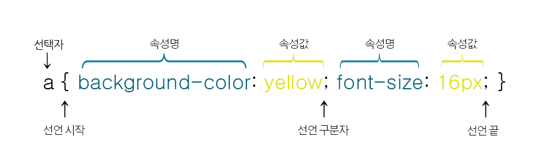

# CSS
## CSS란? 
> Cascading Style Sheets의 약자

## CSS 문법


CSS의 문법은 선택자(selector)와 선언부(declaratives)로 구성됩니다.

선택자는 CSS를 적용하고자 하는 HTML 요소(element)를 가리킵니다.

선언부는 하나 이상의 선언들을 세미콜론(;)으로 구분하여 포함할 수 있으며, 중괄호({ })를 사용하여 전체를 둘러쌉니다.

각 선언은 CSS 속성명(property)과 속성값(value)을 가지며, 그 둘은 콜론(:)으로 연결됩니다.

이러한 CSS 선언(declaration)은 언제나 마지막에 세미콜론(;)으로 끝마칩니다.

## CSS 선택자

스타일을 적용할 HTML 요소를 가리키는 데 사용하는 선택자는 다음과 같습니다.
- 전체 선택자

- HTML 요소 선택자

- 아이디(id) 선택자

- 클래스(class) 선택자

- 그룹(group) 선택자

### (1) 전체 선택자
CSS를 적용할 대상으로 HTML 문서 내부의 모든 요소를 선택합니다.
```
<style>

    * { color: red; }

</style>
```
### (2) HTML 요소 선택자
CSS를 적용할 대상으로 HTML 요소의 이름을 직접 사용하여 선택할 수 있습니다.
```
<style>

    h2 { color: teal; text-decoration: underline; }

</style>
```
### (3) 아이디(id) 선택자
- 아이디 선택자는 CSS를 적용할 대상으로 특정 요소를 선택할 때 사용합니다.

- 이 선택자는 웹 페이지에 포함된 여러 요소 중에서 특정 아이디 이름을 가지는 요소만을 선택해 줍니다.
- id 어트리뷰트 값은 중복될 수 없는 유일한 값이다.
```
<style>

    #heading { color: teal; text-decoration: line-through; }

</style>

```
### (4) 클래스(class) 선택자
클래스 선택자는 특정 집단의 여러 요소를 한 번에 선택할 때 사용합니다.

이러한 특정 집단을 클래스(class)라고 하며, 같은 클래스 이름을 가지는 요소들을 모두 선택해 줍니다.
```
<style>

    .headings { color: lime; text-decoration: overline; }

</style>
```

### (5) 그룹(group) 선택자
그룹 선택자는 위에서 언급한 여러 선택자를 같이 사용하고자 할 때 사용합니다.

그룹 선택자는 여러 선택자를 쉼표(,)로 구분하여 연결합니다.

이러한 그룹 선택자는 코드를 중복해서 작성하지 않도록 하여 코드를 간결하게 만들어 줍니다.
```
<style>

    h1 { color: navy; }

    h1, h2 { text-align: center; }

    h1, h2, p { background-color: lightgray; }

</style>
```
