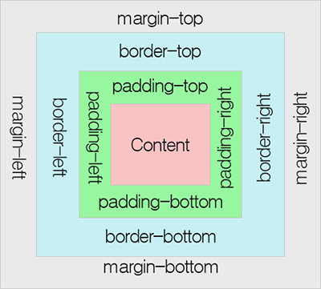

# CSS 박스 모델
## 박스 모델(box model)
모든 HTML 요소는 박스(box) 모양으로 구성되며, 이것을 박스 모델(box model)이라고 부릅니다.

박스 모델은 HTML 요소를 패딩(padding), 테두리(border), 마진(margin), 그리고 내용(content)으로 구분합니다.



1. 내용(content) : 텍스트나 이미지가 들어있는 박스의 실질적인 내용 부분입니다. width, height 프로퍼티를 갖는다.

2. 패딩(padding) : 내용과 테두리 사이의 간격입니다. padding 프로퍼티 값은 패딩 영역의 두께를 의미하며 기본색은 투명(transparent)이다. 요소에 적용된 배경의 컬러, 이미지는 패딩 영역까지 적용되며 패딩은 눈에 보이지 않습니다.

3. 테두리(border) : 내용와 패딩 주변을 감싸는 테두리영역으로 border 프로퍼티 값은 테두리의 두께를 의미한다.

4. 마진(margin) : 테두리(Border) 바깥에 위치하는 요소의 외부 여백 영역이다. margin 프로퍼티 값은 마진 영역의 두께를 의미한다. 기본적으로 투명(transparent)하며 배경색을 지정할 수 없다. 마진은 눈에 보이지 않습니다.

```
<style>

    div {
        /* 배경색의 지정: 콘텐츠 영역과 패딩 영역에 적용된다. */
        background-color: red;
        /* 콘텐츠 영역의 너비 */
        width: 300px;
        padding: 50px;
        border: 20px solid maroon;
        margin: 50px;
    }
</style>
```

## (1) 패딩(padding) 속성
CSS에서는 HTML 요소의 패딩 영역을 설정하기 위해 다음과 같은 속성을 제공합니다.


1. padding-top 

2. padding-right 

3. padding-bottom 

4. padding-left 

```
<style>

    div.pad {
        padding-top: 50px;

        padding-right: 10px;

        padding-bottom: 30px;

        padding-left: 100px;
    }

</style>
```
### 패딩 축약 표현(padding shorthand)
모든 padding 속성을 이용한 스타일을 한 줄에 설정할 수 있습니다.
```
<style>

    div.four { padding: 20px 50px 30px 50px; }

    div.three { padding: 20px 50px 30px; }

</style>
```
### 패딩 개수별 순서 설정
|개수 |순서|예시|
|--|--|--|
|4개 | top, right, bottom, left 순으로 설정|ex) padding: 10px 20px 30px 40px;|
3개|top, right와 left, bottom 순으로 설정 |ex) padding: 10px 20px 30px;|
|2개|top과 bottom, right와 left 순으로 설정|ex) padding: 10px 20px;|
1개|모든 패딩값을 같게 설정|ex) padding: 10px;|

## (2) 테두리(border)
border 속성은 내용(content)과 패딩(padding) 영역을 둘러싸는 테두리의 스타일을 설정합니다.
### border-style 속성
border-style 속성을 이용하면 테두리(border)를 다양한 모양으로 설정할 수 있습니다.

 

- dotted : 테두리를 점선으로 설정함.

- dashed : 테두리를 약간 긴 점선으로 설정함.

- solid : 테두리를 실선으로 설정함.

- double : 테두리를 이중 실선으로 설정함.

- groove : 테두리를 3차원인 입체적인 선으로 설정하며, border-color 속성값에 영향을 받음.

- ridge : 테두리를 3차원인 능선효과가 있는 선으로 설정하며, border-color 속성값에 영향을 받음.
- outset : 테두리를 3차원인 외지로 끼운 선으로 설정하며, border-color 속성값에 영향을 받음.

- none : 테두리를 없앰.

- hidden : 테두리가 존재하기는 하지만 표현되지는 않음.

```
<style>

    .dotted {border-style: dotted;}

    .dashed {border-style: dashed;}

    .solid {border-style: solid;}

    .double {border-style: double;}

    .groove {border-style: groove;}

    .ridge {border-style: ridge;}

    .inset {border-style: inset;}

    .outset {border-style: outset;}

    .none {border-style: none;}

    .hidden {border-style: hidden;}

    .mix {border-style: solid dashed dotted double;}

</style>
```
## border-width 속성
border-width 속성은 테두리(border)의 두께를 설정합니다.

px, em, cm 등과 같은 CSS 크기 단위를 이용하여 두께를 직접 설정할 수 있습니다.

또한, 미리 설정해 놓은 예약어인 thin, medium, thick을 사용하여 설정할 수도 있습니다.
```
<style>

    .dottedA { border-style: dotted; border-width: 2px; }

    .dottedB { border-style: dotted; border-width: 5px; }

    .dashedA { border-style: dashed; border-width: thin; }
    
    .dashedB { border-style: dashed; border-width: thick; }

    .doubleA { border-style: double; border-width: 5px; }

    .doubleB { border-style: double; border-width: thick; }

    .mix { border-style: solid; border-width: 1px 2px 10px thick; }

</style>
```

### border-color 속성
border-color 속성은 테두리(border)의 색상을 설정합니다.

기본적인 color 속성값들뿐만 아니라 투명한 선을 나타내는 transparent 속성값을 사용할 수도 있습니다.

border-color 속성값이 설정되지 않으면 해당 요소의 color 속성값을 그대로 물려받습니다.
```
<style>

    .red { border-color: red; }

    .green { border-color: rgb(0,255,0); }

    .blue { border-color: #0000FF; }

    .mix { border-color: red green blue maroon; }

    .color { color: teal; }

</style>
```
### 테두리(border)의 개별 설정
CSS를 사용하면 테두리의 위쪽, 오른쪽, 아래쪽, 왼쪽 부분에 대하여 개별적으로 스타일을 적용할 수 있습니다.
```
<style>

    .mixA {

        border-top-style: dotted;

        border-right-style: double;

        border-bottom-style: dotted;

        border-left-style: double;

    }

    .mixB { border-style: dotted double; }

</style>
```
### 테두리 개수별 순서 설정
|개수 |순서|예시|
|--|--|--|
|4개 | top, right, bottom, left 순으로 설정|ex) border-style: dotted dashed solid double;|
3개|top, right와 left, bottom 순으로 설정 |ex) border-style: dotted dashed solid;|
|2개| top과 bottom, right와 left 순으로 설정|ex) border-style: dotted dashed;|
1개|모든 테두리의 스타일을 같게 설정|ex) border-style: dotted;|

## 마진
### 마진(Margin)
margin 속성은 테두리(border)와 이웃하는 요소 사이의 간격인 마진 영역의 크기를 설정합니다.

이러한 마진 영역은 패딩 영역과는 달리 background-color 속성으로 설정하는 배경색의 영향을 받지 않습니다.

CSS를 사용하면 마진 영역의 크기를 방향별로 따로 설정할 수 있습니다.
### 마진(margin) 속성
CSS에서는 HTML 요소의 마진 영역을 설정하기 위해 다음과 같은 속성을 제공합니다.


1. margin-top

2. margin-right

3. margin-bottom

4. margin-left

 

margin 속성값을 음수로 설정하여 해당 요소를 다른 요소의 위에 겹치게 할 수도 있습니다.

```
<style>

div.mar {

    margin-top: -25px;

    margin-right: 10px;

    margin-bottom: 30px;

    margin-left: 100px;

}

</style>
```

margin 속성값을 inherit로 설정하면, 부모(parent) 요소의 margin 속성값을 그대로 물려받습니다.

```
<style>

    div.parent { height: 100px; margin-left: 100px; }

    div.child { background-color: #FFF8DC; margin-left: inherit; }

</style>
```

### 마진 축약 표현(margin shorthand)
모든 margin 속성을 이용한 스타일을 한 줄에 설정할 수 있습니다.
```
<style>

    div.four { margin: 20px 50px 30px 50px; }

    div.three { margin: 20px 50px 30px; }

</style>
```
### 마진 개수별 순서 설정
|개수 |순서|예시|
|--|--|--|
|4개 | top, right, bottom, left 순으로 설정|ex) margin: 10px 20px 30px 40px;|
3개| top, right와 left, bottom 순으로 설정 |ex) margin: 10px 20px 30px;|
|2개|  top과 bottom, right와 left 순으로 설정|emargin: 10px 20px;|
1개|모든 마진값을 같게 설정|ex) margin: 10px;|

### margin 속성값에 auto를 사용하는 이유
margin 속성값을 auto로 설정하면, 웹 브라우저가 수평 방향 마진(margin) 값을 자동으로 설정합니다.

즉, 해당 HTML 요소의 왼쪽과 오른쪽 마진을 자동으로 설정하게 됩니다.

그 결과 해당 요소는 그 요소를 포함하고 있는 부모(parent) 요소의 정중앙에 위치하게 됩니다.
```
<style>

    div {

        border: 2px solid teal;

        width: 300px;

        margin: auto;

    }

</style>
```