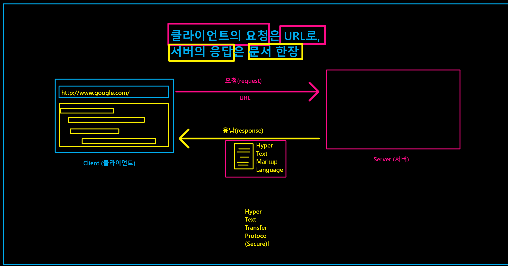

# HTML
## 1. WWW (World Wide Web)
 
 인터넷에 연결된 컴퓨터를 통해 사람들이 정보를 공유할 수 있는 전 세계적인 정보 공간. 간단히 Web이라 부르는 경우가 많다. 이 용어는 인터넷과 동의어로 쓰이는 경우가 많으나 엄격히 말해 서로 다른 개념이다. 웹은 전자 메일과 같이 인터넷 상에서 동작하는 하나의 서비스일 뿐이다. 그러나 1993년 이래로 웹은 인터넷 구조의 절대적 위치를 차지하고 있다.

 인터넷에서 HTTP 프로토콜, 하이퍼텍스트, HTML형식 등을 사용하여 그림과 문자를 교환하는 전송방식을 말하기도 한다.

## 2. **웹의 기초**

### 2.1 **요청과 응답**

**URL을 요청하면 문서 한장으로 응답**
>모든 web 공간에서의 통신은 request(요청)과 response(응답)으로 이루어져있다.

### 2.2 **client(클라이언트)와 server(서버)**
- client : 요청을 보내는 주체
- server : 응답을 보내는 주체

## 3. **HTML, HTTP**
### 3.1 HTML

- 웹 페이지 표시를 위해 개발된 지배적인 마크업 언어 
- HTML은 제목, 단락, 목록 등과 같은 본문을 위한 구조적 의미를 나타내는 것뿐만 아니라 링크, 인용과 그 밖의 항목으로 구조적 문서를 만들 수 있는 방법을 제공
-  이미지와 객체를 내장하여 대화형 양식을 생성하는 데 사용
-  HTML은 웹 브라우저와 같은 HTML 처리 장치의 행동에 영향을 주는 자바스크립트, 본문과 그 밖의 항목의 외관과 배치를 정의하는 CSS 같은 스크립트를 포함하거나 불러올 수 있다

> H: Hyper
> 
> T: Text
> 
> M: markup
> 
> L: language
>
> 뜻 : 하이퍼텍스트를 가장 중요한 특징으로 하는 마크업이라는 형식을 가진 컴퓨ㅓ 프로그래밍 언어

-  Hyper text
  
  >참조(하이퍼링크)를 통해 독자가 한 문서에서 다른 문서로 즉시 접근할 수 있는 텍스트
  > 
  >하이퍼링크 : 문서 안에서 직접 모든 형식의 자료를 연결하고 가리킬 수 있는 참조 고리

- mark down 또한 mark up 언어이다

### 3.2  **WYSIWYG**

>W : What
>
>Y : You
>
>S : See
>
>I : Is
>
>W : What
>
>Y : You
>
>G :Get

>문서 편집 과정에서 화면에 포맷된 낱말, 문장이 출력물과 동일하게 나오는 방식. 편집 명령어를 입력하여 글꼴이나 문장 형태를 바꾸는 방식과 구별(내가 쓴거랑 보이는거랑 달라지는 프로그램)
>
>대표적: 마크다운

ex) 추석을 검색했을때 url디코더에서 확인하면 
https://search.naver.com/search.naver?where=nexearch&sm=top_hty&fbm=0&ie=utf8&query=%EC%B6%94%EC%84%9D

%EC%B6%94%EC%84%9D = 추석

## 4. HTTP 

- W3 상에서 정보를 주고받을 수 있는 프로토콜
- 주로 HTML 문서를 주고받는 데에 쓰임
- 주로 TCP를 사용하고 HTTP/3부터는 UDP를 사용하며, 80번 포트를 사용한다. 1996년 버전 1.0, 그리고 1999년 1.1이 각각 발표
>HTTP : Hyper text transfer protocol
https = + (secure)

>http라는 곳에서 html을 주고받는 것

## 4.1 WEB's history

||web 1.0|web 2.0|web 3.0|
|--|--|--|--|
|정보처리|읽기만 가능|읽기,쓰기|읽기,쓰기,소유|
|운영 주체|회사,개인|거대플랫폼|네트워크|
|인프라|개인컴퓨터|클라우드,모바일|블록체인,메타버스|

- 블록체인

탈중앙화된 분산 데이터베이스 기술로, 정보를 안전하게 기록하고 관리하는 기술입니다.

- Decentralization (탈중앙화)

"어떤 네트워크 내에서 일어난 사건에 대한 사실과 의사결정에 관련된 합의를 중앙의 권위있는 집단으로부터 네트워크 내 다수에게 분산시키거나 위임하는 프로세스"