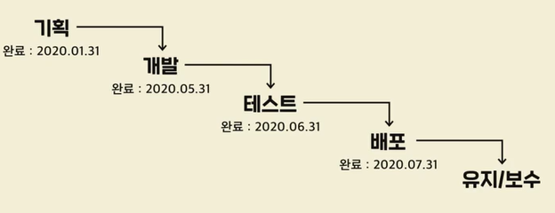
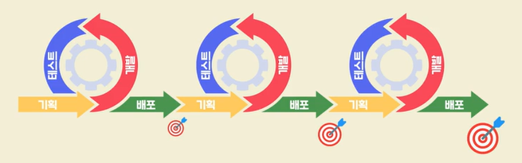

# 프로그래밍의 분야
## 컴퓨터 사이언스의 기본
- 객체지향 프로그래밍
- 알고리즘
- 자료구조

## 소프트웨어 공학
- 소프트웨어로 제품/서비스를 만드는 방법에 대한 학문
(기획,제작,테스트,출시,사후관리)
1. 기획:어떤것을 만들지 정하는 단계(기획자가 필요한것을 문서로 완성)
2. 개발: 기획한것을 만드는 단계 (문서를 받아 프로그램을 제작)
3. 테스트: 개발이 기획대로 잘 되었는지 확인하는 단계(프로그램이 잘 작동되는지 확인)
4. 배포:개발된 제품/서비스를 사용자가 사용하는 단계(프로그램을 사용자가 사용할수 있도록 공개)
5. 유지/보수:출시된 서비스를 변화시키는 단계 (오류 개선 및 추가적인 기능 개발)

## 프로세스 관리
1. 폭포수(Waterfall) : 각 단계를 완료하고 다음 단계로 넘어가는 방식

> 기획-> 개발->테스트 ->배포 ->유지/보수

- 특징
1) 각 단계를 한번에 완벽하게 끝내기 힘들 수 있음
2) 수정 사항이 많이 생길 가능성이 높고, 개발자들이 수정 사항을 반영하기 힘듦

2. 애자일(Agile): 결과물을 만들어 미리 확인하고 수정하며 진행 / 영문 뜻: 재빠른,민첩한

- 특징

중간중간 사용하면서 발전시키기 때문에 기능 변경이 유연함

## 테스트 프로세스
- 버그 관리 툴
1. Jira
2. asana
3. Trella

- 이슈(issue)
이슈(issue) = 문제점 + 사용자 요구사항 + 미래 전략
    - 관리시스템 : 이슈트리킹툴
- 이슈(issue)의 상태
1. Open: 이슈 생김
2. In-progress : 개발자가 개선 작업 진행
3. Resolved : 문제가 해결됨(개발자가 작업 완료)
4. Closed : 테스트 결과 버그가 잘 해결됨
5. Reopen: 추가적인 문제가 발생시 다시 Open으로 돌아감

## IDE
`통합개발환경 (Intergrated Development Environment)` : 개발자들이 코딩할때 도움이 되는 기능을 모아둔 프로그램

- 대표적으로 VScode가 있다.

### IDE 외 개발자들이 많이 사용하는 프로그램

- 프로젝트 관리 툴
Jira, Trello, Asana,Confluence
- 메신저인
Slack, Skype, Jandi
- 디자인 협업 툴
Sketch
