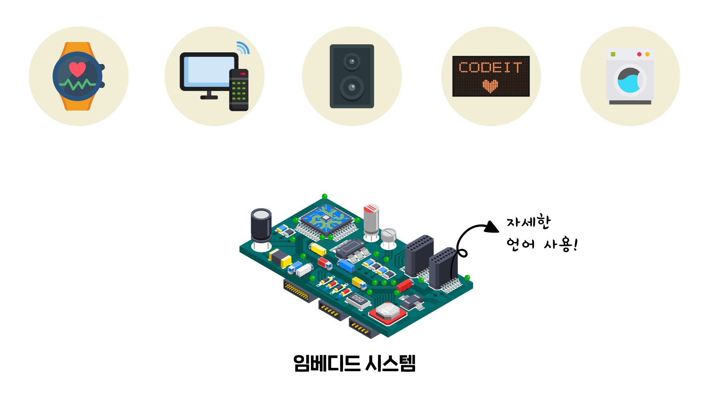

# 프로그래밍 언어의 종류

- 객체 지향 프로그래밍 언어인가? (객체를 지향하는 언어 vs. 객체를 지향하지 않는 언어)
- 변수의 데이터 타입을 어떻게 사용하는가? (Dynamic Typing 언어 vs. Static Typing 언어)

이 두 가지 기준으로 현재 사용되고 있는 프로그래밍 언어들을 나눠보면, 크게 세 가지 부류가 있습니다.
 1. '자세한 언어'
 2. '체계적인 언어'
 3. '쉬운 언어'

## 자세한 언어

자세한 언어로는 Low-level에 가까운 어셈블리 언어나 C 언어 등이 있습니다. 객체 지향 개념이 적용되지 않고, 코드를 작성할 때 자료형 등의 컴퓨터적 구조를 다 고려해줘야 하는 언어입니다.

이 언어들은 사람보다는 컴퓨터의 논리적인 사고방식에 맞추어져 있다는 특징이 있어서 사람들이 작성하기는 어렵지만, 컴퓨터가 실행하기는 좋습니다. 프로그램을 빠르고 효율적으로 만드는데 최적화되어 있죠. 그래서 스마트 워치, TV, 스피커, 전광판, 가전제품 등, 컴퓨터가 메인이 아닌 기계에 자주 사용됩니다. 이런 기계들은 보통 이런 작은 칩에서 돌아갑니다. 그래서 저장 공간이나 성능이 컴퓨터보다 상당히 열악합니다. 여기서 C 같은 '자세한 언어'가 핵심적으로 사용됩니다.

참고로, 이런 곳에 들어가는 시스템을 임베디드 시스템이라고 부릅니다. IoT라고 해서, 이런 임베디드 시스템을 연결해서, 스마트홈을 만들거나, 기계들 사이의 통신을 할 수 있게 하기도 합니다.

임베디드 시스템 말고도 자세한 언어가 활약할 수 있는 분야가 있습니다.
예를 들어 수많은 문자를 거의 실시간으로 전송해야 하는 텔레그램 같은 채팅 애플리케이션이나 트위치 같은 동영상 스트리밍 서비스, 검색 엔진, 개발자들이 코드 관리를 위해 사용하는 github, 머신 러닝 같은 빅데이터 처리 속도와 알고리즘이 중요한 그런 분야의 회사에서 많이 사용됩니다.
사람이 코딩하는 시간은 길어지지만, 컴퓨터가 실행하는 시간은 조금이라도 빠르게 하고 싶은 그런 경우들이죠.

- 장점
  - 프로그램을 만들기만 하면 컴퓨터가 실행하는 속도는 매우 빠르다. 
  - 성능이 안 좋은 컴퓨터에 적용하기 좋다.
- 단점
  - 코드를 작성하거나 고치는 게 힘들고 오래 걸린다.

## 체계적인 언어

자세한 언어와 마찬가지로 static typing 언어이지만, 객체 지향 개념이 적용된 언어인데요. Java나 C++ 같은 언어들이 여기에 속하고, 체계가 잡혀있기 때문에, 여러 사람이 함께 작업하기에 가장 적합하고, 협업 과정에서 오류가 적어서 주로 큰 규모의 프로젝트에 적합합니다.

규모가 큰 기업들에서는 Java를 많이 사용하고 있는데요. 구글, 에어비앤비, 우버 뿐 아니라 이베이, 핀터레스트, 스포티파이, 트립 어드바이저, 아마존, 인텔, 필립스, 회사 이름으로 나열하려면 끝도 없습니다. 그래서 취업을 하려면 Java를 해라. 이런 얘기도 있죠.

- 장점 
  - 짜임새와 협업이 중요한, 규모가 큰 프로젝트에 적합하다. 객체 지향 개념이 적용되어서, “자세한 언어”보다 유지보수 하기가 편하다.
- 단점
  -  '자세한 언어'보다는 낫지만, 여전히 문법이 완전 쉽지는 않다. 코드를 작성하는 시간보다도 체계적으로 설계하는 데에 시간이 오래 걸릴 수 있다.

## 쉬운 언어

객체 지향 개념이 적용된, dynamic typing 언어를 말하며, 프로그래머가 아닌 사람도 비교적 쉽게 배우고 사용할 수 있는 Python, Ruby 등의 언어가 여기에 속합니다.

이 언어들은 최대한 간결하고, 짧은 코드를 추구하죠, 문법도 간편해서, 코드를 작성하는 시간이 가장 짧습니다. 귀찮은 건 다 컴퓨터에 맡겨버리는 거죠.
파이썬에는 이런 말이 있습니다.“life is short you need python” 인데요. 인생이 짧은 만큼 빨리빨리 개발할 수 있는 파이썬을 사용하라는 말입니다. 또, "Simple is better than complex" 이런 말도 있는데요. 간결한 것이 복잡한 것보다 낫다는 뜻인데요. 복잡하게 하지말고 간편하게 코딩하자.이런 뜻입니다.  
Ruby의 개발자 마츠모토 유키히로는 “루비는 스트레스가 없는 쉬운 프로그래밍 언어입니다. 프로그래밍 언어는 컴퓨터가 아닌 인간 중심으로 설계되어야 합니다” 라고 하기도 했습니다.

쉬운 언어가 어떤 철학을 가졌는지 이해되시나요? 쉬운 언어는 빠르게 개발이 필요한, 변화가 많고 잦은 분야에서 많이 사용되고, 데이터 사이언스, 업무 자동화와 같이 개인 규모의 프로젝트에서도 가장 많이 사용됩니다.

- 장점: 
  - 진입 장벽이 낮다. 
  - 배우기 쉽다. 
  - 코드를 읽거나 수정하기가 가장 간편하다. 
  - 코드를 빨리 작성할 수 있다.
- 단점
  - 코드 작성 시간은 짧지만, 컴퓨터의 코드 실행 속도가 느리다. 성능 제약이 심한 곳에서 빠른 속도를 내야 하는 경우는 사용할 수 없다.
  -  프로그래밍 코드 문법에 제약이 너무 없어서, 큰 규모의 프로젝트에서 실수를 방지하기가 어렵다.
  -   많은 사람들의 협업에는 부적합할 수 있다.
