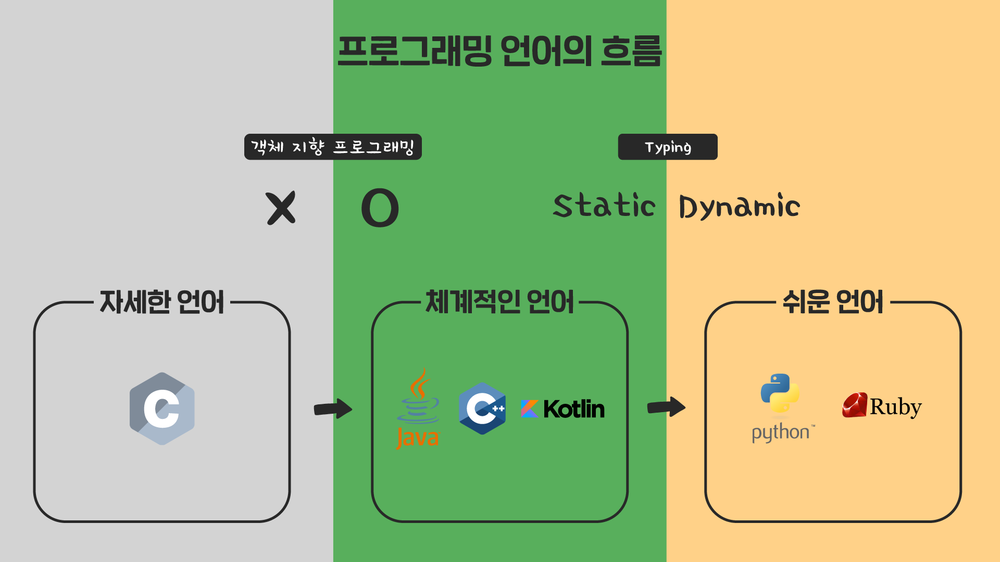
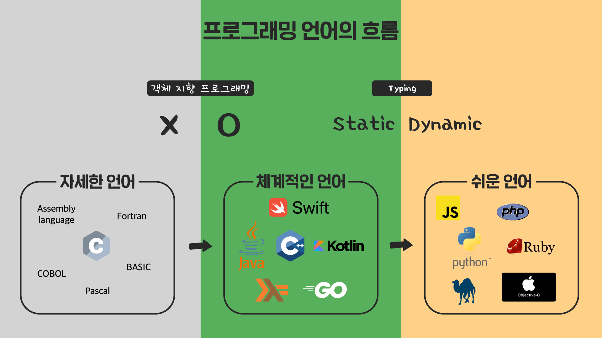
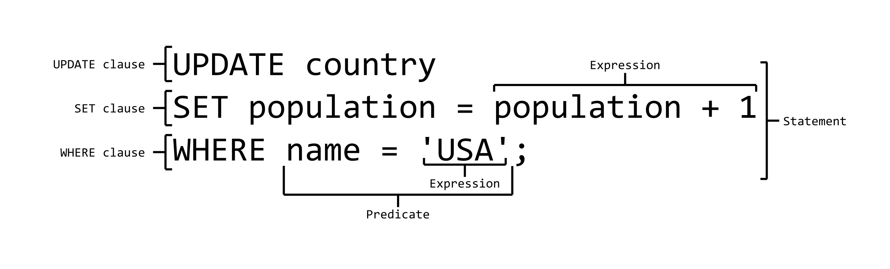
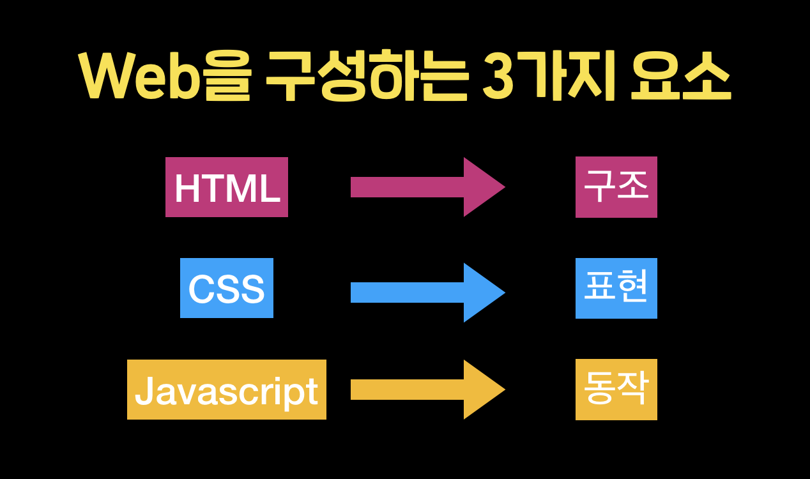

# 프로그래밍 언어의 흐름
컴퓨터와 칩의 성능이 좋지 않던 시기에는 "자세한 언어”들이 등장했고,그 다음에 협업과 생산성 향상에 좋은 객체 지향 프로그래밍이 대세로 떠오르면서 “체계적인 언어”가 인기를 얻었고, 누구나 프로그래밍을 배우고 할 수 있는 최근에 들어서서는 “쉬운 언어”가 인기를 끌었다.

하지만, 이러한 분류들이 언어를 나누는 절대적인 기준이라고 볼 수는 없고, 필요에 따라서 언어들이 등장했다 정도로만 이해하시면 된다.

왜냐면 C가 요즘도 활발히 쓰이고 있고, 코틀린 같은 “체계적인 언어”에 속하는 언어들도 비교적 최근에 등장했기떄문이다

- “자세한 언어” : 어셈블리 언어, Fortran, COBOL, Pascal, BASIC 등
- “체계적인 언어” : Go, Kotlin, Haskell, Swift 등
- “쉬운 언어” : JavaScript, PHP, Perl, Objective-C 등

## 특수목적 언어
- 앞서 살펴본 언어들은 일반적인 용도로 만들어진 프로그래밍 언어 (General-purpose programming language)였는데, 특별한 목적을 위한 프로그래밍 언어 (Domain-specific programming language)들도 있다.

- ex) R, SQL, HTML, CSS 등

### R
- R은 주로 통계 소프트웨어 개발과 데이터 분석 및 시각화에 널리 사용되고 있다.
- 특히 통계나 빅데이터 분석에 필요한 데이터 전처리, 분석, 수학적인 계산과 그래프를 그리는 등의 기능에 특화되어 있다.

### SQL
- SQL은 데이터베이스를 관리하기 위한 목적의 프로그래밍 언어이다.
- 데이터베이스란 데이터를 모아둔 공간을 의미하는데,프로그래머들은 SQL을 사용해서 데이터베이스를 설계하거나 운영하고 관리한다.
- 요즘에는 데이터가 워낙 많이 활용되기 때문에, 개발자 뿐 아니라 마케터나 데이터 분석가들이 SQL을 사용하여 서비스의 데이터(매출, 고객 정보 등)를 분석하곤 한다.
- 예를 들어, 아래는 USA 국가의 인구를 1 증가시키는 SQL 코드이다.
- 

### HTML, CSS
- HTML과 CSS는 웹 페이지를 만들 때 사용힌다.
- HTML는 주로 웹 페이지의 구조와 레이아웃을 담당하고, CSS는 웹 페이지의 시각적인 표현을 담당한다.

- 주로 여기에 JavaScript를 함께 사용해서, 웹 페이지가 사용자와 상호 작용할 수 있게 만들기도 합니다.

### 그 외의 특수 목적 언어

- MATLAB : 공학 시뮬레이션용 프로그래밍 언어
- Csound : 소리와 음악 합성에 사용되는 프로그래밍 언어
- Scratch : 블록을 조립하여 쉽게 자기 자신의 이야기나 게임 그리고 애니메이션을 만들 수 있는 교육용 프로그래밍 언어
등의 다양한 특수 목적 언어들이 있습니다.