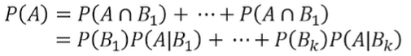
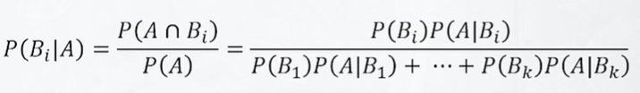
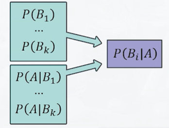

# 베이즈 정리
> 베이즈 정리 : 데이터라는 조건이 주어졌을 떄의 조건부확률을 구하는 공식 ex) P(결과|원인)=>P(원인|결과)

## 표본공간의 분할과 전확률 공식
### 표본공간의 분할
- $B_1,...,B_k$ 가 다음 조건을 만족하면 표본 공간$S$의 분할이라고 함
- 서로 다른 $i,j$에 대해 $B_i$와 $B_j$가 교집합이 없을떄 = 상호배반 
- $B_1 \cup B_2 ... B_k$ = S

### 전확률 공식
- 사건 $B_1,...,B_k$는 상호배반이며 $B_1 \cup B_2 ... B_k$ = $S$라고 함
- 이때 $S$에서 정의되는 임의의 사건A에 대하여 다음이 성립

## 베이즈 정리
- 사건 $B_1,...,B_k$는 상호배반이며 $B_1 \cup B_2 ... B_k = S$ 라고함 
- 이때 사건 A가 일어났다는 조건 하에서 사건 $B_i$가 일어날 확률은 다음과 같음
- 
### 베이즈 정리 활용
- $B_1,...,B_k$으로 분할된 사건의 각 확률을 알고, 각 $B_i$를 전제로 했을 때의 사건 A가 발생할 조건부 확률을 알 때 사건A를 전제로 한 각 $B_i$의 조건부 확률을 구하기 위한 정리.
- 
- * 원인별 결과의 조건부 확률을 알고 있을 때, 결과를 전제로 각 원인의 조건부 확률을 도출