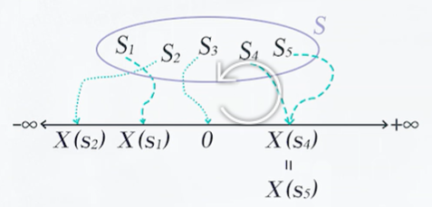
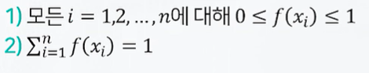
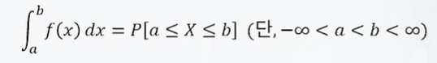
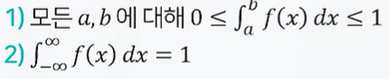
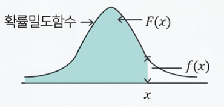
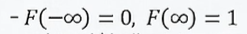
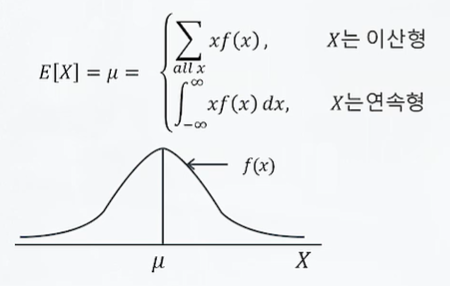
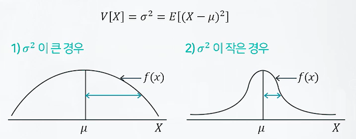
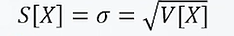

# 확률변수와 확률분포, 분포의 특성치
## 확률 변수와 확률 분포
### 확률변수
- 표본공간에서 정의된 실수값 함수
- 

###  확률변수의 종류 
- 이산형 : 확률변수가 취할 수 있는 값이 셀 수 있는 경우
- 연속형 : 주어진 구간에서 모든 실수 값을 취할 수 있어 셀 수 없는 경우

## 확률분포
### 확률 질량 함수
  - 확률 변수 X가 이산형인 경우 X가 취할 수 있는 값 $x_1,x_2 ...x_n$의 각각에 대하여 확률 $P[X=x_1]$,$P[X=x_2]$...$P[X=x_n]$을 대응시켜주는 관계를 X의 학률질량함수라고하며$f(x)$로 표기

$f(x_i)$ = $P[X=x_i]$,   $i = 1,2,...,n$

- 확률질량함수의 성질
    

### 확률 밀도 함수
  - 확률변수 X가 연속형인 경우 X가 가질 수 있는 구간(-무한대,무한대)위에서의 함수f(x)가 다음을 만족할 떄, 이를 X의 확률밀도함수라고함

- 확률밀도함수의 성질
  

### 누적분포함수
  - -X의 확률밀도함수가f(x)일때,X의 누적분포함수F(x)는 X<=x인 모든X에 대한f(x)의 적분값이 됨
  - 
  - 
  - x가 증가할떄 F(x)도 증가하며,F(x)는 음의 값을 가질 수 없음

### 확률분포의 특성치
- 기대값 : 분포의 무게중심, 중심 위치를 나타냄
  - 
- 분산 : 분포의 산포를 나타냄 
  - 

- 표준편차: 분산의 제곱근. 단위가 보정됨
  - 