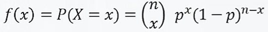
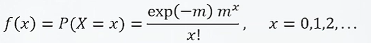
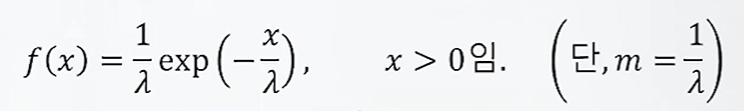
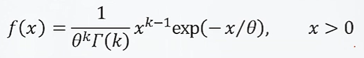
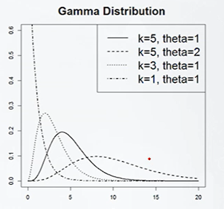

# 이항분포,포아송분포,지수분포,감마분포
## 이항분포
### 베르누이 시행
1) 매 시행마다 성공 또는 실패의 오직 두가지 가능한 결과만 가짐
2) 성공의 확률이 p로 일정함
- 위 두가지 조건을 만족하는 실험

### 이항 확률 변수가 고려되는 실험
- 매 시행마다 
  1) 성공 또는 실패의 오직 두가지 가능한 결과만 가짐
  2) 성공의 확률이 p로 일정함
- 위 조건을 만족하는 베르누이 시행을
  - 독립적으로
  - n번 반복하는 실험
### 이항확률변수와 확률질량함수
- X: n번 시행 중 성공의 횟수로 정의
- x = 0,1,...,n의 값을 가짐
- 
- 이 경우 $X~Bin[n,p]$라고함

### 이항분포의 특성치
- $X~Bin[n,p]$인경우, 
- $E[X] = np$
- $V[X] = np(1-p)$

## 포아송분포
### 포아송 확률변수와 확률질량함수
- 단위시간에 (t=1), 포아송확률과정을 따르는 사건A가 발생하는 횟수를 X로 정의하면,
- 
- 이 경우 X~POI[m]라고함

### 포아송 분포의 특성치
- X~POI[m]인경우
- E[X] = V[X] =m

## 지수분포
### 지수확률변수와 확률밀도함수
- 단위구간에서 평균발행횟수가 m인 포아송 확률 과정을 따르는 사건A가 한번 일어난 뒤 그 다음 또 일어날 때까지 걸리는 시간W로 정의됨
- 
- 이 경우 X~EXP[R]

### 지수분포의 특성치 
- X~EXP[R]인 경우
  - E[X] = R
- 포아송 모수와 지수 모수는 역의 관계
  - 단위구간 내 평균발생횟수가m인 포아송 과정을 따르는 사건을 사건 사이 소요시간의 평균이 R = 1/m 임
  
## 감마분포
### 감마확률변수와 확률밀도함수
- 감마확률변수X의 확률밀도함수는 양수인 0와 K에 대하여 다음과 같이 정의됨
- 
- 이 경우 X~GAMMA[k,0]라고 함

### 감마분포의 특성치
- X~GAMMA[k,0]인 경우에
- E[X]=k0
- V[X]=K0^2

